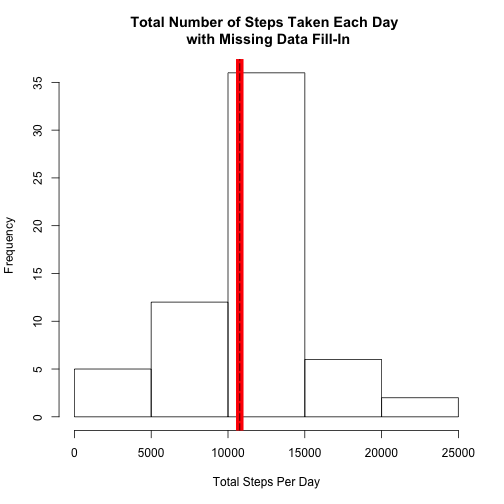

Reproducible Research: Peer Assessment 1
========================================================

# Introduction
It is now possible to collect a large amount of data about personal movement using activity monitoring devices such as a [Fitbit](http://www.fitbit.com/), [Nike Fuelband](http://www.nike.com/us/en_us/c/nikeplus-fuelband), or [Jawbone Up](https://jawbone.com/up). These type of devices are part of the “quantified self” movement – a group of enthusiasts who take measurements about themselves regularly to improve their health, to find patterns in their behavior, or because they are tech geeks. But these data remain under-utilized both because the raw data are hard to obtain and there is a lack of statistical methods and software for processing and interpreting the data.

This assignment makes use of data from a personal activity monitoring device. This device collects data at 5 minute intervals through out the day. The data consists of two months of data from an anonymous individual collected during the months of October and November, 2012 and include the number of steps taken in 5 minute intervals each day.

# Data
The data for this assignment can be downloaded from the course web site:
- Dataset: [Activity monitoring data](https://d396qusza40orc.cloudfront.net/repdata%2Fdata%2Factivity.zip) [52K]

The variables included in this dataset are:
- **steps**: Number of steps taking in a 5-minute interval (missing values are coded as <span style="color:red">NA</span>)
- **date**: The date on which the measurement was taken in YYYY-MM-DD format
- **interval**: Identifier for the 5-minute interval in which measurement was taken

The dataset is stored in a comma-separated-value (CSV) file and there are a total of 17,568 observations in this dataset.

# Assignment
This assignment will be described in multiple parts. You will need to write a report that answers the questions detailed below. Ultimately, you will need to complete the entire assignment in a **single R markdown** document that can be processed by knitr and be transformed into an HTML file.

Throughout your report make sure you always include the code that you used to generate the output you present. When writing code chunks in the R markdown document, always use <span style="color:red">echo = TRUE</span> so that someone else will be able to read the code. **This assignment will be evaluated via peer assessment so it is essential that your peer evaluators be able to review the code for your analysis**.

For the plotting aspects of this assignment, feel free to use any plotting system in R (i.e., base, lattice, ggplot2)

Fork/clone the [GitHub repository created for this assignment](http://github.com/rdpeng/RepData_PeerAssessment1). You will submit this assignment by pushing your completed files into your forked repository on GitHub. The assignment submission will consist of the URL to your GitHub repository and the SHA-1 commit ID for your repository state.

NOTE: The GitHub repository also contains the dataset for the assignment so you do not have to download the data separately.

## Loading and preprocessing the data
Show any code that is needed to

1. Load the data (i.e. <span style="color:red">read.csv()</span>)
2. Process/transform the data (if necessary) into a format suitable for your analysis


```r
# Set R working directory to the directory containing the cloned assignment github repository 
setwd("~/reproducibleResearch/RepData_PeerAssessment1")

# Unzip the activity dataset and load it into R data frame 
data <- read.csv(unzip("activity.zip", "activity.csv"))

# Have a look at the dataset
str(data)
```

```
## 'data.frame':	17568 obs. of  3 variables:
##  $ steps   : int  NA NA NA NA NA NA NA NA NA NA ...
##  $ date    : Factor w/ 61 levels "2012-10-01","2012-10-02",..: 1 1 1 1 1 1 1 1 1 1 ...
##  $ interval: int  0 5 10 15 20 25 30 35 40 45 ...
```

## What is mean total number of steps taken per day?
For this part of the assignment, you can ignore the missing values in the dataset.

1. Make a histogram of the total number of steps taken each day
2. Calculate and report the mean and median total number of steps taken per day


```r
# Get total number of steps grouped by date
totalStepsEachDay <- tapply(data$steps, data$date, sum)

# Get the median and mean of the total number of steps taken per day:
totalStepsEachDayMedian <- median(totalStepsEachDay, na.rm=T)
totalStepsEachDayMean <- mean(totalStepsEachDay, na.rm=T)

# Create a histogram of the total number of steps taken each day
hist(totalStepsEachDay, 
     main="Total Number of Steps Taken Each Day", 
     xlab="Total Steps Per Day")
abline(v=totalStepsEachDayMedian, col="red", lwd=10)
abline(v=totalStepsEachDayMean, lty=5)
```

 

The **mean** (shown as dotted line) and **median** (shown as red line) of the total number of steps taken per day are 10766.19 and 10765 respectively.  They are obtained from R computation as shown below:  


```r
sprintf("%.2f", totalStepsEachDayMean)
```

```
## [1] "10766.19"
```

```r
sprintf("%.2f", totalStepsEachDayMedian)
```

```
## [1] "10765.00"
```

## What is the average daily activity pattern?
1. Make a time series plot (i.e. type = "l") of the 5-minute interval (x-axis) and the average number of steps taken, averaged across all days (y-axis)
2. Which 5-minute interval, on average across all the days in the dataset, contains the maximum number of steps?


```r
# Group data by 5-min intervals, then calculate the mean of steps taken for each interval
library(reshape2)

dataMelt <- melt(data, id=c("date", "interval"), measure.vars=c("steps"))
intervalDataMean <- dcast(dataMelt, interval ~ variable,mean,na.rm=TRUE)

# Locate 5-min interval with the maximum average number of steps:
intervalWithAveMaxStep <- intervalDataMean[which.max(intervalDataMean$steps),1]

# Create a time series plot of the 5-minute interval (x-axis) and the average number of steps taken (y-axis)
plot(intervalDataMean$interval, intervalDataMean$steps, 
     type="l", 
     xlab="5-Minute Interval", 
     ylab="Average Number of Steps")
abline(v=intervalWithAveMaxStep, lty=5, col="red")
text(1600,190, paste("Interval ", intervalWithAveMaxStep, " (indicated dotted line) i.e. the \n 5-minute interval starting at 8:35 AM has \nthe average maximum steps of", round(max(intervalDataMean$step), digit=4)), col="red")
```

 

## Imputing missing values
Note that there are a number of days/intervals where there are missing values (coded as <span style="color:red">NA</span>). The presence of missing days may introduce bias into some calculations or summaries of the data.

**(1)** Calculate and report the total number of missing values in the dataset (i.e. the total number of rows with <span style="color:red">NAs</span>)

```r
sum(rowSums(is.na(data)))
```

```
## [1] 2304
```

**(2)** Devise a strategy for filling in all of the missing values in the dataset. The strategy does not need to be sophisticated. For example, you could use the mean/median for that day, or the mean for that 5-minute interval, etc.

```r
# Divide data into dataWithNA and dataWithNoNA datasets
dataWithNA <- data[!complete.cases(data), ]
dataWithNoNA <- data[complete.cases(data), ]

# Use the mean step for that 5-minute interval to fill in the missing values for the variable
# steps corresponding to that 5-minute interval in the dataWithNA dataset 
dataWithNA$steps <- intervalDataMean$steps[match(dataWithNA$interval,unique(dataWithNA$interval))]
head(dataWithNA)
```

```
##     steps       date interval
## 1 1.71698 2012-10-01        0
## 2 0.33962 2012-10-01        5
## 3 0.13208 2012-10-01       10
## 4 0.15094 2012-10-01       15
## 5 0.07547 2012-10-01       20
## 6 2.09434 2012-10-01       25
```

```r
tail(dataWithNA)
```

```
##        steps       date interval
## 17563 2.6038 2012-11-30     2330
## 17564 4.6981 2012-11-30     2335
## 17565 3.3019 2012-11-30     2340
## 17566 0.6415 2012-11-30     2345
## 17567 0.2264 2012-11-30     2350
## 17568 1.0755 2012-11-30     2355
```

**(3)** Create a new dataset that is equal to the original dataset but with the missing data filled in.

```r
# Merge row-wise dataWithNA dataset having missing values fill-in  with dataWithNoNA dataset:
combineData <- rbind(dataWithNA, dataWithNoNA)

# Sort the combineData dataset by date:
newData <- combineData[order(combineData$date),]

# Have a look at the new dataset
str(newData)
```

```
## 'data.frame':	17568 obs. of  3 variables:
##  $ steps   : num  1.717 0.3396 0.1321 0.1509 0.0755 ...
##  $ date    : Factor w/ 61 levels "2012-10-01","2012-10-02",..: 1 1 1 1 1 1 1 1 1 1 ...
##  $ interval: int  0 5 10 15 20 25 30 35 40 45 ...
```
There are no missing values (<span style="color:red">NAs</span>) in the new dataset as shown below:

```r
sum(rowSums(is.na(newData)))
```

```
## [1] 0
```

**(4)** Make a histogram of the total number of steps taken each day and calculate and report the **mean** and **median** total number of steps taken per day. Do these values differ from the estimates from the first part of the assignment? What is the impact of imputing missing data on the estimates of the total daily number of steps?

```r
# Get total number of steps taken each day for the new dataset:
newTotalStepsEachDay <- tapply(newData$steps, newData$date, sum)

# Calculate the mean and median of the total number of steps taken each day for the new dataset
newTotalStepsEachDayMedian <- median(newTotalStepsEachDay, na.rm=T)
newTotalStepsEachDayMean  <- mean(newTotalStepsEachDay, na.rm=T)

# Plot histogram of the total number of steps taken each day for the new dataset
hist(newTotalStepsEachDay, 
     main="Total Number of Steps Taken Each Day \n with Missing Data Fill-In", 
     xlab="Total Steps Per Day")
abline(v=newTotalStepsEachDayMedian, col="red", lwd=10)
abline(v=newTotalStepsEachDayMean, lty=5)
```

 

With imputing missing values, the new **mean** and **median** of the total number of steps taken each day are exactly the same.  The new **mean** (shown as dotted line) and **median** (shown as red line)  are 10766.19 and 10766.19 respectively.  They are obtained from R computation as shown below:  

```r
sprintf("%.2f", newTotalStepsEachDayMean)
```

```
## [1] "10766.19"
```

```r
sprintf("%.2f", newTotalStepsEachDayMedian)
```

```
## [1] "10766.19"
```

Whereas, without imputing missing values, The **mean** and **median** of the total number of steps taken per day are 10766.19 and 10765 respectively.  So, the **mean** and **median** differ slightly.

Therefore, missing-values imputation increases the median slightly (making it closer to the mean) without changing the mean of the total number of steps taken per day.  

## Are there differences in activity patterns between weekdays and weekends?
For this part the weekdays() function may be of some help here. Use the dataset with the filled-in missing values for this part.

**(1)** Create a new factor variable in the dataset with two levels – “weekday” and “weekend” indicating whether a given date is a weekday or weekend day.

```r
# Add a new factor variable called weekdays to newData dataset with two levels – “weekday” and “weekend”
newData$weekdays <- as.factor(ifelse(weekdays(as.Date(newData$date), abbreviate=TRUE) %in% c("Sat","Sun"),
                                     "weekend", "weekday")
                              )

# Have a look at the new variable named weekdays added to the newData dataset
str(newData)
```

```
## 'data.frame':	17568 obs. of  4 variables:
##  $ steps   : num  1.717 0.3396 0.1321 0.1509 0.0755 ...
##  $ date    : Factor w/ 61 levels "2012-10-01","2012-10-02",..: 1 1 1 1 1 1 1 1 1 1 ...
##  $ interval: int  0 5 10 15 20 25 30 35 40 45 ...
##  $ weekdays: Factor w/ 2 levels "weekday","weekend": 1 1 1 1 1 1 1 1 1 1 ...
```


```r
 summary(newData$weekdays)
```

```
## weekday weekend 
##   12960    4608
```

**(2)** Make a panel plot containing a time series plot (i.e. type = "l") of the 5-minute interval (x-axis) and the average number of steps taken, averaged across all weekday days or weekend days (y-axis). 

```r
# Group data first by weekdays then by 5-min intervals, then calculate the mean of steps taken
library(reshape2)

newDataMelt <- melt(newData, id=c("weekdays", "interval"), measure.vars=c("steps"))
weekdaysData <- dcast(newDataMelt, weekdays+interval ~ variable,mean,na.rm=TRUE)

# Create a panel plot containing a time series plot of the 5-minute interval (x-axis) and the average
# number of steps taken, averaged across all weekday days or weekend days (y-axis)
library(lattice)

xyplot(weekdaysData$steps ~ weekdaysData$interval | weekdaysData$weekdays, 
       data=weekdaysData, 
       layout=c(1,2), 
       type="l", 
       xlab="5-Minute Interval", 
       ylab="Average Number of Steps")
```

 

